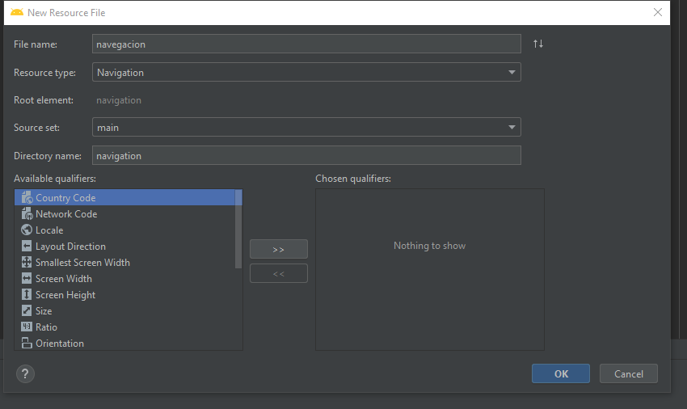
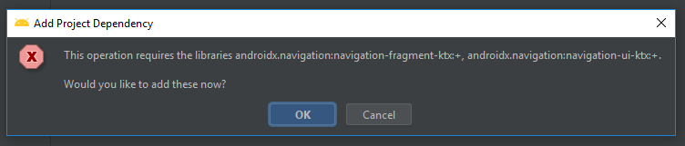
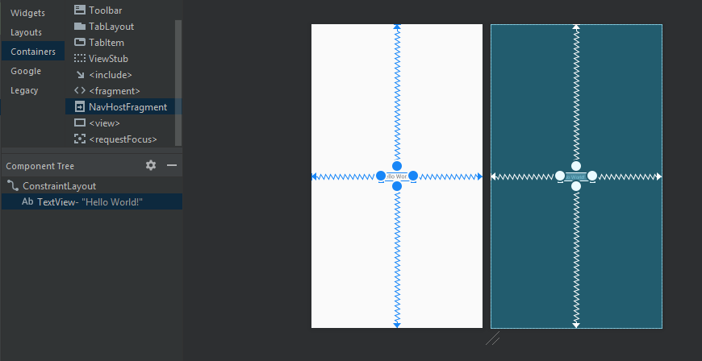
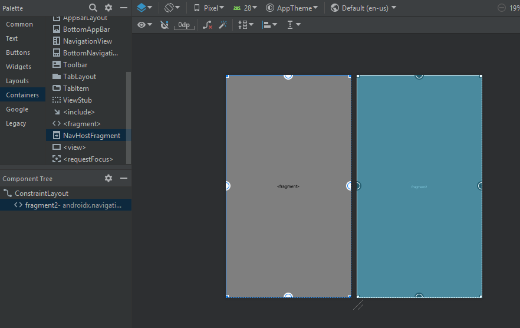
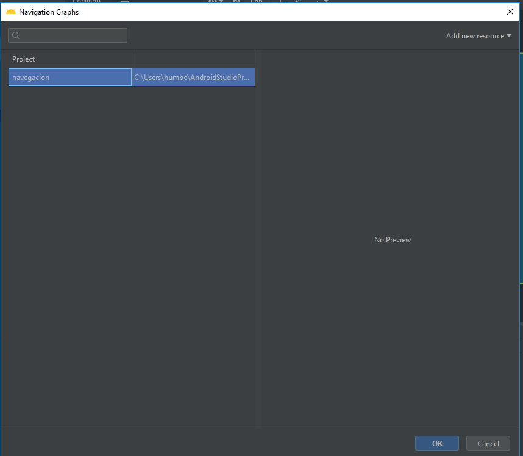
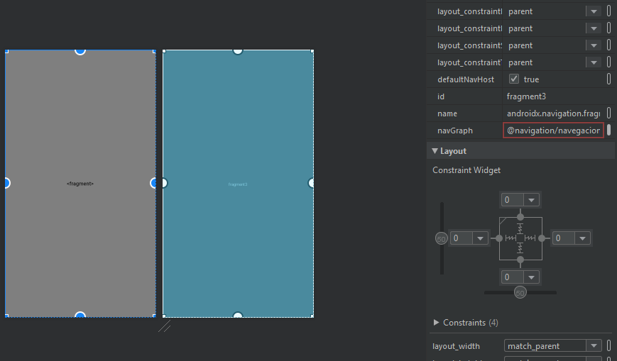
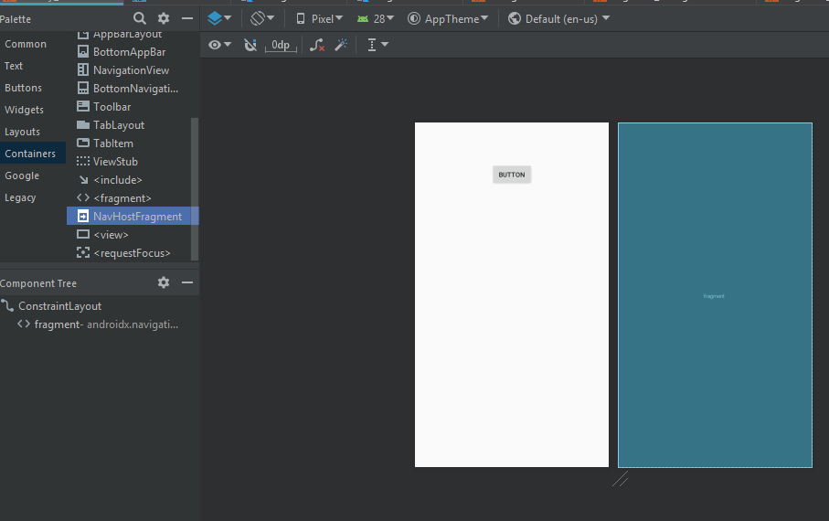
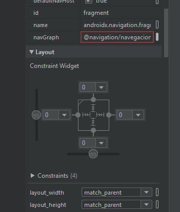

# NavegacionIntro

Para empezar un proyecto con navegacion primero creamos un elemento de tipo Navigation dentro de la carpeta resources como se muestra en la siguiente imágen

A continuación nos solicitará importar la biblioteca de fragmentos, le damos OK

Eliminamos el texto que nos aparece por default y dejamos el ConstraintLayout

En la paleta de componentes seleccionamos Containers y seleccionamos la opción NavHostFragment la cual arrastarmos al layout:

Una vez hecho esto, nos aparecerá un cuadro indicandonos a que navegador se va a asociar, este Main activity se convierte en un hospedador de fragmentos, es decir, 
el layout del Main activity solo va a servir para hospedar a los fragmentos, no se va a diseñar

Nos muestra en la parte del navGraph el enlazamiento hecho y procedemos a dejar en 0 las anclas del texto

El siguiente paso es irnos al layout del main_activity y quitar el textview  y dejar solamente el ConstraintLayout, de la paleta de componentes arrastrar un  del menu de Containers

La opcion NavHostFragment y agregarla a tu vista, asegurate de darles las anclas en los cuantro extremos a cero.

Deepues de eso te pedira generar un archivo de navegacion, lo generas y le das de nombre navegacion, se va a generar una nueva carpeta en resources, que se llama navigation y dentro de ella
aparece en archivo de navegación.
Este archivo de navegacion debe estar ligado a la main activity activity para que pueda funcionar. Esta union se lleva a cabo de la siguiente manera

