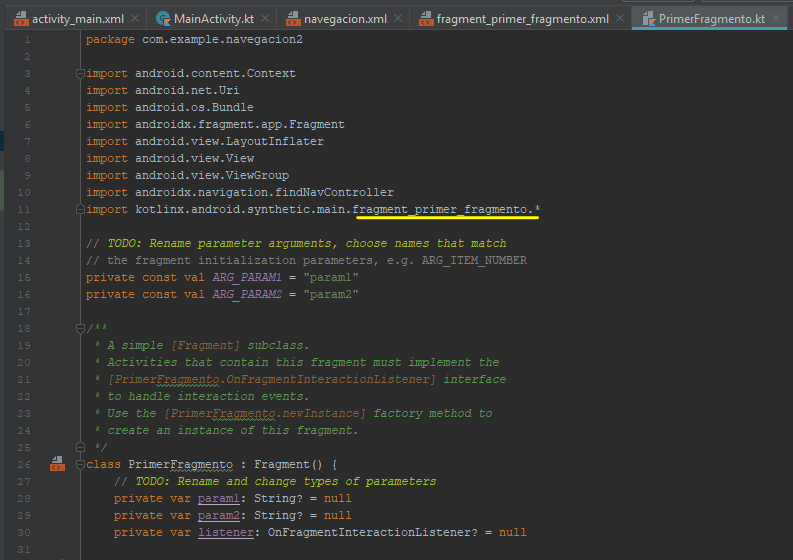

# NavegacionIntro

Para empezar un proyecto con navegacion primero creamos un elemento de tipo Navigation dentro de la carpeta resources como se muestra en la siguiente imágen

A continuación nos solicitará importar la biblioteca de fragmentos, le damos OK

Eliminamos el texto que nos aparece por default y dejamos el ConstraintLayout

En la paleta de componentes seleccionamos Containers y seleccionamos la opción NavHostFragment la cual arrastarmos al layout:

Una vez hecho esto, nos aparecerá un cuadro indicandonos a que navegador se va a asociar, este Main activity se convierte en un hospedador de fragmentos, es decir, 
el layout del Main activity solo va a servir para hospedar a los fragmentos, no se va a diseñar

Nos muestra en la parte del navGraph el enlazamiento hecho y procedemos a dejar en 0 las anclas del texto

Un fragmento en Android es una parte de la interfaz de usuario y estan relacionados a una misma activity, cada fragmento tambien tiene asociada su propia clase, asi como un layout 
tiene asociado un activity.

Ahora generamos los fragmentos,esto se hace en el archivo de "navegación" que se generó en el paso 1. le damos doble click:

Le damos click en la imagen con el signo "+"

Seleccionamos la opción "Create new destinatoon"

Nos aparece un cuadro de dialogo para nombrar al fragmento, le damos el nomnre y le damos OK

Ahora generamos un segundo fragmento realizando el paso anterior, pueden ser tantos fragmentos que se necesiten:

Nota importante: cada que se genera un fragmento tienen asociada una clase, la cual genera una excepción la cual debe ser borrada al ejecutarse.

El la carpeta java se encuentran las clases, seleccionamos la primer opción e ingresamos a la clase:

Una vez que ingresamos al PrimerFragmento, borramos la linea que se indica a continuación:

Procedemos de la misma forma a borrar esa linea del código del SegundoFragmento:

Regresamos a la carpeta "navegacion" y seleccionamos la estrella que se indica en la imagen, esto con la finalidad de ordenar los fragmentos, es importante
mencionaer que el fragmento que tiene la imagen de una casita en su parte superior, es la que se visualizará al inicio de la aplicación:

Enlazamos la flecha del primer fragmento con la segunda, arrastrando hasta llegar al segundo fragmento:

Seleccionamos la flecha que comunica los fragmnetos y procedemos a nombrar su ID, en este caso se le ponemos "primero_a_segundo", a continuación le damos la animación 
al fragmento, con el nombre que tienen cada uno de éstos, los cuales aparecen dentro de las opciones:

Ahora editaremos cada pantalla, en esta ocasión pondremos un botón al fragmento 1 para pasar al fragmento 2:

Dentro de la carpeta layout, seleccionamos el primerfragmento y procedemos a borrar el texto que viene por default en cada unos de los layaout, seleccionando TextView y lo suprimimos:

En la paleta seleccionamos el layout, seleccionamos el Constraintlayout, lo arrastramos y se expande:

Le agregamos un botón para poder navegar de un fragmento a otro y veamos si funciona la navegación, le ponemos un ID al boton, así como lo anclamos con las dimensiones correspondientes
y le cambiamos el texto al botón.

Ahora agregamos un método que se llame onviewcreate el cual nos hará el trabajo de pasar de una pantalla a otra, escribimos "override fun onViewCreated" y le damos enter y nos
aparece el código siguiente:

Anexamos la siguiente parte de código la cual va a dar funcionalidad al botón que ingresamos al layout, método findNavController nos hará el cambio de una pantalla a otra.

Para que pueda hacerse uso del boton1 es importante importar éste:

Para poder ingresar un video en el segundo fragmento, primero debemos quitar el margen superior de la pantalla para que el video se muestre de forma completa, nos posicionamos 
en la carpeta VALUES, abrimos el archivo styles.xml:

Agregamos a la linea styles la siguiente instrucción NoActionBar:

Para ingresar un video en el fragmento2, nos posicionamos en la paleta de herramientas , en Widgets, seleccionamos la opción VideoView, arrastramos esta última opción sl lsyout:

Damos el margen correspondiente al Video que vamos a colocar en el layout:

En la carpeta manifests, abrimos el archivo AndroidManifest.xml para dar el permiso correspondiente:

Agregamos la linea que se indica a continuación con la finalidad de dar el permiso a Internet:

Una vez que agregamos el permiso a Internet, en el fragmento2 que es en donde aparacerá el video, anexamos el siguiente código para que el video pueda reproducirse una vez que cambiemos a ese layout,
creamos un onViewCreated:

Importamos el método View:

Anexamos las siguientes líneas de código, donde indicaremos la ruta en la cual se encuentra el video a presentar en el layout, asi como los métodos que harán que el video se visualice:

